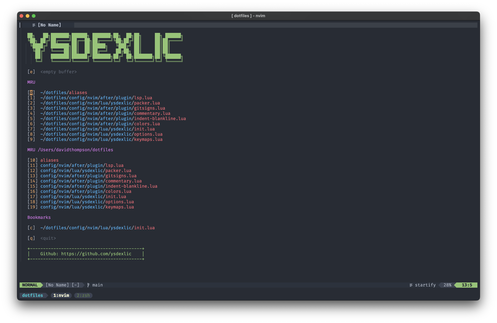
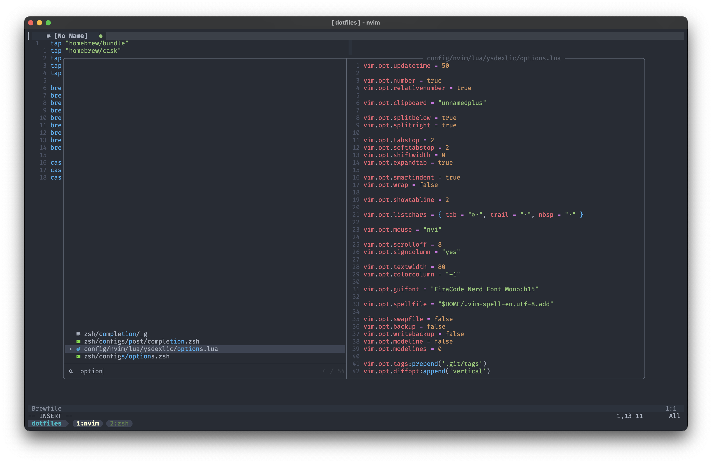
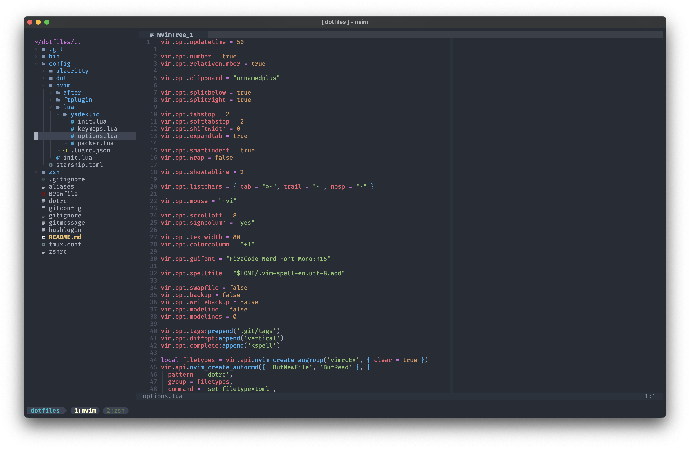
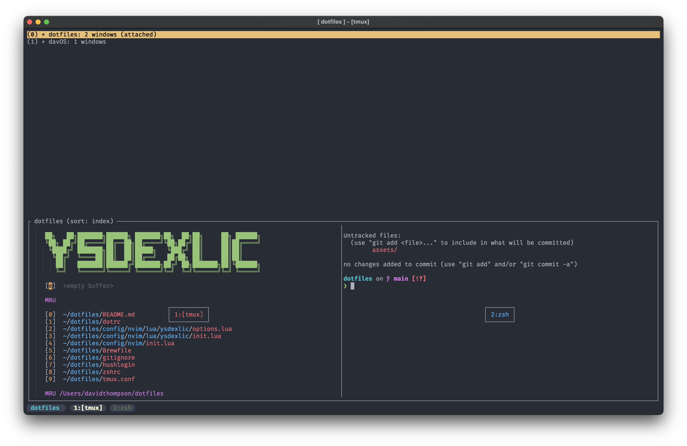

# Dotfiles

## Requirements

Make sure `zsh` is your default shell, if not, set zsh as your login shell:

```sh
chsh -s $(which zsh)
```

# Install

### Run

```sh
/bin/bash -c "$(curl -fsSL https://thebeardydeveloper.com/setup)"
```

This script is intended to be run on a Mac, you can see the script at [bin/setup-mac](./bin/setup-mac)

This installs the necessary CLIs ([git](http://git-scm.com/) & [homebrew](https://brew.sh/)), will install all the packages specified in the [Brewfile](./Brewfile) and then executes the bootstrap script in [`config/dot/bootstrap/install`](./config/dot/bootstrap/install).

### _OR_

Clone onto your machine:

```sh
git clone git://github.com/ysdexlic/dotfiles.git ~/dotfiles
```

(Or, [fork and keep your fork
updated](http://robots.thoughtbot.com/keeping-a-github-fork-updated)).

Install [dot](https://github.com/ysdexlic/dot):

```sh
brew install ysdexlic/formulae/dot
```

Install the dotfiles with the boostrap flag `-b`:

```sh
env DOTRC=$HOME/dotfiles/dotrc dot -b
```

After the initial installation, you can run `dot` without the one-time variable
`DOTRC` being set (`dot` will symlink the repo's `dotrc` to `~/.dotrc` for
future runs of `dot`).

This command will create symlinks for config files in your home directory.
The [dotrc](./dotrc) file tells dot to:

- Exclude the `README.md` any other files files, which are part of
  the `dotfiles` repository but do not need to be symlinked in.
- Give precedence to personal overrides which by default are placed in
  `~/dotfiles-local`. [See more about local customizations below](#localized-customizations)

It will also install any dependencies needed (if the `-b` bootstrap flag is
passed), such as
[oh-my-zsh](https://github.com/ohmyzsh/ohmyzsh) and
[starship](https://starship.rs/) before installing the Vim plugins listed in
[packer.lua](./config/nvim/lua/ysdexlic/packer.lua).

# Zsh Configurations

Additional zsh configuration can go under the `~/dotfiles-local/zsh/configs` directory. This
has two special subdirectories: `pre` for files that must be loaded first, and
`post` for files that must be loaded last.

# NeoVim configuration

Additional configurations can be added in `config/nvim/lua/<SOMETHING>` as long as it's 'required' in the `init.lua`.
Plugin specific configuration can be added in `config/nvim/after/plugin/<PLUGIN_NAME>`.

NeoVim documentation can be seen [here](https://neovim.io/doc/) or by typing `:h` in the nvim command line.

# Localized customizations

With [dot](https://github.com/ysdexlic/dot) you can have multiple dotfile directories, this means you could have project, machine or user specific overrides.

Using this dotfile repo, the [dotrc](./dotrc) already specifies an additional dotfile directory (`~/dotfiles-local`) where you can store your personal customizations:

```sh
mkdir ~/dotfiles-local
```

If your customizations are to a file that already exists, e.g. `zshrc` you can use a slightly different file name, i.e. appending `.local` on the end of it and sourcing it (if it exists) from the original `zshrc` as can be seen [here](./zshrc).

## What's in it?

Configs for:

- [Zsh](https://ohmyz.sh/)
- [Vim/Neovim](https://neovim.io/)
- [Tmux](https://github.com/tmux/tmux/wiki)
- [Git](http://git-scm.com/)
- [Alacritty terminal](https://github.com/alacritty/alacritty)

## Screenshots

### Vim





### Tmux


